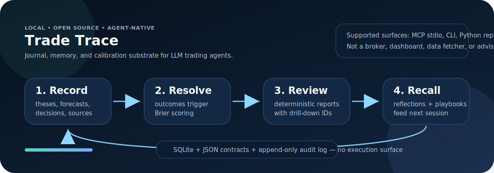
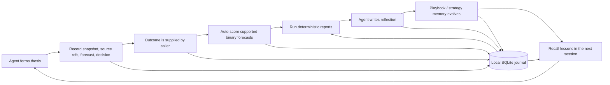
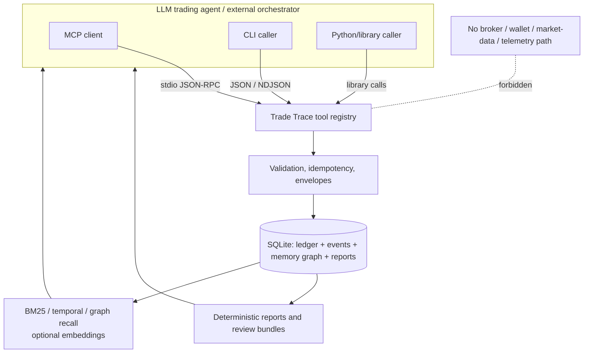

# Trade Trace

<p align="center">
  
</p>

<p align="center">
  <strong>Local, open-source journal, memory, and calibration for LLM trading agents.</strong><br>
  A grader and continuity layer for agent trading process — <em>not</em> a trader.
</p>

<p align="center">
  <a href="https://github.com/mcrescenzo/trade-trace"></a>
  <a href="./LICENSE"></a>
  <a href="./docs/AI_AGENT_MCP_GETTING_STARTED.md"></a>
  <a href="./docs/architecture/contracts.md"></a>
  <a href="./SECURITY.md"></a>
</p>

---

Trade Trace gives an LLM trading agent what most trading bots do not have: an auditable memory of what it believed, what it did, what happened, how calibrated it was, and which lessons should carry into the next session.

It records decisions and outcomes, scores supported forecasts, produces deterministic retrospective reports, stores reflections in a typed trading-native memory graph, versions playbooks, and surfaces fresh-session continuity/work-queue views. It runs locally on SQLite and speaks through MCP stdio, a JSON-first CLI, and Python/library report APIs.

It never places trades, fetches market data, resolves outcomes from external venues, stores broker/wallet credentials, phones home, or gives financial advice.

## Why agents need it

LLM trading agents can research, forecast, and act — but without a durable process layer, every run starts half-amnesic:

| Without Trade Trace | With Trade Trace |
|---|---|
| Forecasts disappear into transcripts | Forecasts become scored, queryable rows |
| Outcomes are remembered anecdotally | Binary forecasts get Brier/calibration diagnostics |
| Mistakes are free-text and hard to audit | Reports return metrics plus drill-down record IDs |
| A new session repeats old reasoning | Recall surfaces relevant observations, reflections, and playbook rules |
| Strategy lessons smear across unrelated trades | Strategies scope decisions, reports, recall, and reflection |
| Retries risk duplicate or conflicting writes | Idempotency keys make write loops replay-safe |

The product question is simple:

> Can the agent become **auditable, calibratable, and more process-aware over time** without giving the journal any execution power?

Trade Trace is built to make the answer yes.

## The loop



Trade Trace supplies the substrate. The agent supplies the judgment. Reports and coach packets are deterministic diagnostics, not opinions or recommendations.

## What ships

| Capability | What it does |
|---|---|
| **Agent-native journal** | Stores venues, instruments, snapshots, sources, theses, forecasts, decisions, outcomes, reviews, positions, and tags. |
| **Calibration and scoring** | Scores supported binary forecasts on final outcomes and reports Brier, reliability bins, ECE, sharpness, baselines, and integrity caveats. |
| **Typed memory graph** | Retain / Recall / Reflect for observations, reflections, and playbook rules, with typed edges to ledger rows and bi-temporal validity. |
| **Playbooks and adherence** | Versions procedural rules, records whether rules were considered/followed/overridden/not applicable, and reports adherence patterns. |
| **Strategies** | Groups decisions, theses, reviews, reports, recall, and reflections under named edge theses without turning strategies into execution logic. |
| **Deterministic reports** | Calibration, forecast diagnostics, source quality, audit readiness, risk/opportunity diagnostics, P&L where local projection data exists, strategy health/performance, recall receipts, and review bundles. |
| **Fresh-session continuity** | `agent.next_actions`, `report.work_queue`, and `report.lifecycle` expose local process obligations for stateless agents without scheduling, assigning, or fetching anything. |
| **MCP + CLI parity** | Same tool registry, JSON envelopes, validation semantics, stable error codes, schemas, and dry-run/idempotency contracts across transports. |
| **Local-first storage** | One SQLite database with append-only/auditable source events, idempotent writes, JSONL export/import surfaces, and SHA-256-verified backup/restore. |

## What it is not

Trade Trace is intentionally narrow:

- **Not a trade executor.** No order placement, routing, signing, broker keys, wallet keys, seed phrases, or private keys.
- **Not a data fetcher.** It does not query venues, market data APIs, outcome APIs, order books, or broker state. The calling agent supplies snapshots, sources, and outcomes.
- **Not a dashboard.** The former human Console UI was removed. Supported surfaces are MCP stdio, CLI, and Python/library reports.
- **Not financial advice.** Reports are retrospective diagnostics and process review. They do not recommend trades or claim profitable edge.
- **Not a generic memory framework, backtester, scheduler, tax tool, or social platform.** The schema is trading-shaped and local.

## Architecture at a glance



A fresh local install makes zero outbound network calls. Optional embeddings are explicit opt-in: local model download/import or API embedding providers. API embeddings send memory text outward only after configuration-time consent; they are never enabled by default.

## Install

From PyPI:

```bash
pip install trade-trace
export TRADE_TRACE_HOME="$HOME/.trade-trace"
tt journal init
```

For development from a checkout:

```bash
python3 -m pip install -e .
export TRADE_TRACE_HOME="$HOME/.trade-trace"
tt journal init
```

Requirements: Python 3.11+ and SQLite with FTS5. MCP support is bundled in the base package. Optional vector recall support is available with:

```bash
pip install 'trade-trace[embeddings]'
```

The embeddings extra adds vector storage/keyring support. It still does not enable vectors or download model weights until you explicitly configure an embedding provider.

## Quickstart: connect an agent over MCP

Trade Trace's fastest agent path is the stdio MCP server:

```bash
trade-trace-mcp
```

Configure your MCP host to launch that command locally. Do not configure HTTP, SSE, websocket, or TCP transport.

```json
{
  "mcpServers": {
    "trade-trace": {
      "command": "trade-trace-mcp",
      "args": [],
      "env": {
        "TRADE_TRACE_HOME": "/absolute/path/to/.trade-trace",
        "MCP_ACTOR_ID": "agent:research-bot"
      }
    }
  }
}
```

Then have the agent verify:

1. list MCP tools;
2. call `journal.status`;
3. call `tool.schema` with no arguments;
4. call `tool.schema` for the write it is about to use;
5. dry-run writes with `_dry_run: true` before committing.

See the full MCP setup guide: [`docs/AI_AGENT_MCP_GETTING_STARTED.md`](./docs/AI_AGENT_MCP_GETTING_STARTED.md).

## Quickstart: journal a decision with the CLI

The CLI mirrors the MCP catalog. It emits JSON by default; streaming list/read paths use NDJSON envelopes.

```bash
tt journal init

# Discover the live contract for any tool.
tt tool schema --tool forecast.add

# Build the local journal trail.
tt venue add \
  --name Polymarket \
  --kind prediction_market \
  --idempotency-key run-001:venue:polymarket \
  --actor-id agent:research-bot

tt instrument add \
  --venue-id ven_... \
  --asset-class prediction_market \
  --title "Will event X happen by 2026-06-30?" \
  --resolution-criteria-text "Final result from named source by date." \
  --idempotency-key run-001:instrument:event-x \
  --actor-id agent:research-bot

tt thesis add \
  --instrument-id ins_... \
  --side yes \
  --body "Base rate and new evidence support this thesis." \
  --idempotency-key run-001:thesis:event-x \
  --actor-id agent:research-bot

tt forecast add \
  --thesis-id th_... \
  --kind binary \
  --yes-label YES \
  --outcomes-json '[{"outcome_label":"YES","probability":0.58},{"outcome_label":"NO","probability":0.42}]' \
  --resolution-at 2026-06-30T00:00:00Z \
  --idempotency-key run-001:forecast:event-x:v1 \
  --actor-id agent:research-bot

tt decision add \
  --instrument-id ins_... \
  --thesis-id th_... \
  --forecast-id fc_... \
  --type skip \
  --reason "Spread and liquidity constraints were not satisfied" \
  --idempotency-key run-001:decision:event-x \
  --actor-id agent:research-bot
```

When the caller later supplies a final outcome, `outcome.add` / `resolve.record` triggers scoring for supported pending binary forecasts.

```bash
tt outcome add \
  --instrument-id ins_... \
  --outcome-label NO \
  --outcome-value 0 \
  --status resolved_final \
  --resolved-at 2026-06-30T00:00:00Z \
  --idempotency-key run-001:outcome:event-x \
  --actor-id agent:research-bot

tt report calibration
tt report coach
tt memory recall --query "lessons about spread discipline in prediction markets" --compact true
```

Use `tool.schema` as the source of truth for exact fields, enums, examples, dry-run support, and required metadata.

## Safety and privacy model

- **Local by default:** SQLite at `$TRADE_TRACE_HOME/trade-trace.sqlite`.
- **No default outbound network:** fresh init, local journal use, and MCP stdio startup make no outbound calls.
- **No telemetry:** no analytics, phone-home, auto-update, or background sync.
- **No credential persistence:** credential-shaped inputs are dropped or rejected; secret-looking free text is scanned before insertion.
- **Append-only audit posture:** source/event tables are immutable; corrections append new rows/events instead of overwriting history.
- **Replay-safe writes:** retryable writes require idempotency keys; safe replays return the original event; semantic conflicts return `IDEMPOTENCY_CONFLICT`.
- **Versionable backups:** backup manifests use SHA-256 verification before restore.

Read [`SECURITY.md`](./SECURITY.md) for vulnerability reporting and supported-version policy.

## Status

Trade Trace is pre-release (`0.0.x`). The M0–M4 MVP and agent-ready work have landed: storage, manual write surfaces, event log/idempotency, deterministic reports and integrity diagnostics, typed memory graph, strategies, versioned playbooks/adherence, stdio MCP, tool schema discovery, optional embeddings, import surfaces, backup/restore, and fresh-session continuity reports.

No stable `0.0.1` release has been cut yet. See [`docs/RELEASE_CHECKLIST.md`](./docs/RELEASE_CHECKLIST.md).

## Docs map

| Start here | For |
|---|---|
| [`docs/AI_AGENT_MCP_GETTING_STARTED.md`](./docs/AI_AGENT_MCP_GETTING_STARTED.md) | First MCP connection and safe write loop. |
| [`docs/AGENT_GUIDE.md`](./docs/AGENT_GUIDE.md) | Full agent journal loop, continuity surfaces, patterns, pitfalls. |
| [`docs/CLAUDE_CODE.md`](./docs/CLAUDE_CODE.md), [`docs/CLAUDE_DESKTOP.md`](./docs/CLAUDE_DESKTOP.md), [`docs/IDE_MCP_SETUP.md`](./docs/IDE_MCP_SETUP.md) | Client setup recipes. |
| [`docs/VISION.md`](./docs/VISION.md) | Product north star and non-goals. |
| [`docs/PRD.md`](./docs/PRD.md) | Working product requirements and milestone scope. |
| [`docs/architecture/contracts.md`](./docs/architecture/contracts.md) | CLI/MCP JSON envelope, parity, error codes, schemas. |
| [`docs/architecture/memory-layer.md`](./docs/architecture/memory-layer.md) | Memory graph, recall, embeddings posture, typed edges. |
| [`docs/architecture/reports.md`](./docs/architecture/reports.md) | Report filters, drill-down, review bundles, work queue. |
| [`docs/architecture/persistence.md`](./docs/architecture/persistence.md) | SQLite, events, outbox, idempotency, append-only invariants. |
| [`docs/architecture/scoring.md`](./docs/architecture/scoring.md) | Forecast scoring, Brier/calibration metrics, lifecycle caveats. |
| [`docs/architecture/derived-lifecycle.md`](./docs/architecture/derived-lifecycle.md) | Read-only lifecycle/work-queue substrate. |

## License

MIT. See [`LICENSE`](./LICENSE).
